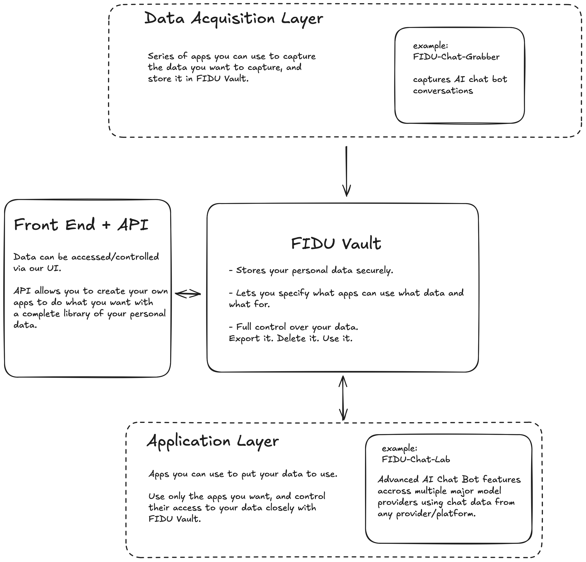
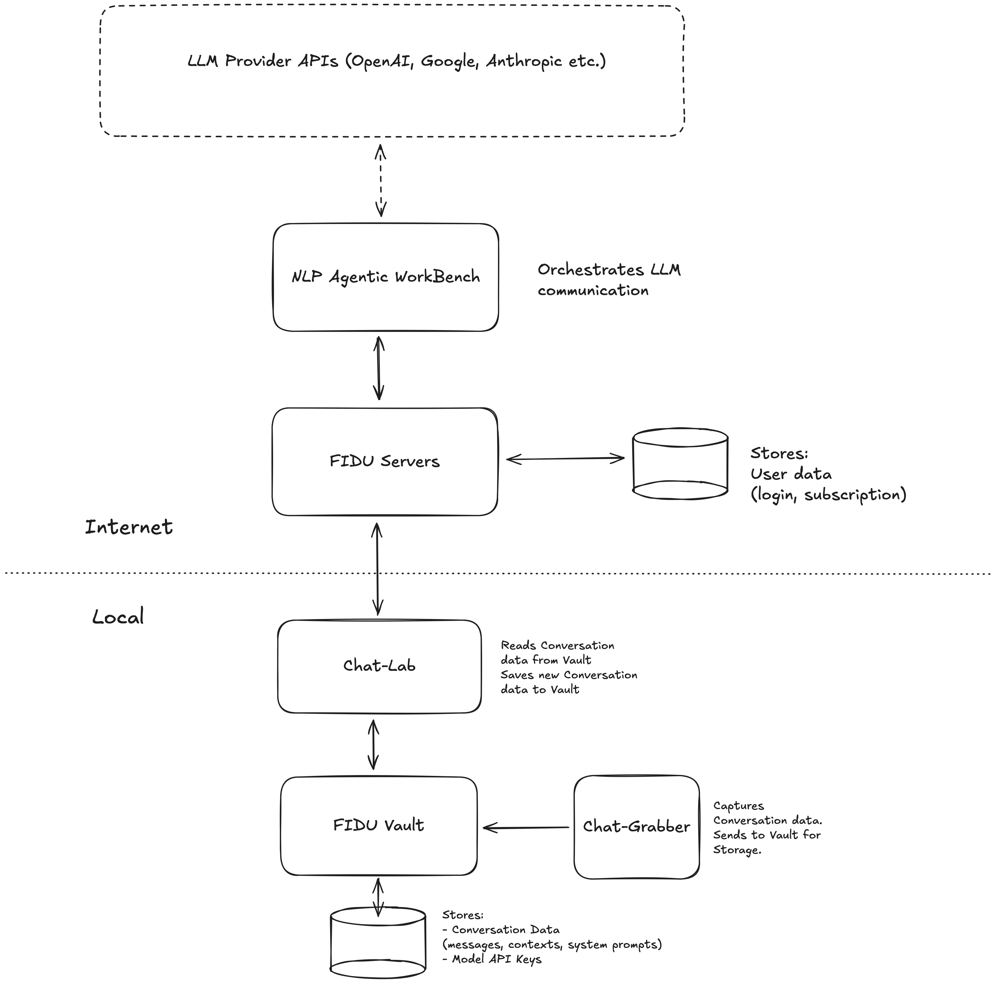
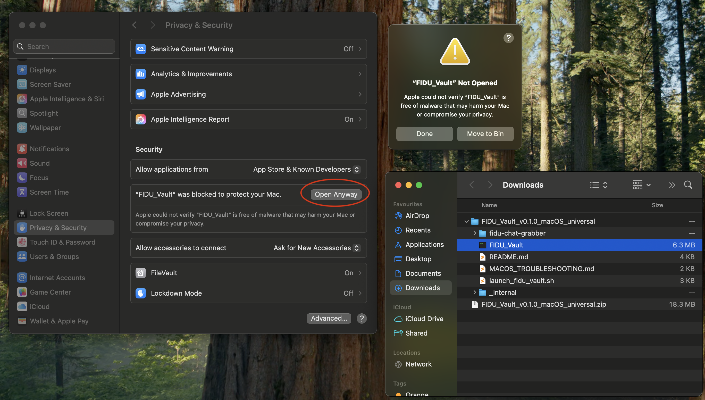

# Quick Start

If you're here, you probably want to get stuck into our tools! 

Go to https://github.com/FirstDataUnion/FIDU/releases and download the binary for your system. It's a very early release, so expect some teething problems. 

The ZIP will contain instructions for running on your platform. Jump to [Installation](#installation) for more detailed guidance or troubleshooting (ESPECIALLY FOR MACOS USERS).

Keep reading for more about the project and what it all does. 

# FIDU

Take control of your digital identity and break free from Big Tech. The FIDU app empowers users to collect and securely store their personal data, define precise preferences for its usage, and serve it to applications and agents strictly on their terms.

## More about FIDU

https://firstdataunion.org

## The Project

This project aims to demonstrate a taste of FIDU's vision. This is an extremely early version, and we're working hard to add new features and apps all the time.

We are offering this early alpha to encourage those interested in our journey to start interacting with our tools, hopefully finding some useful functionality for themselves, as well as helping to shape its future.

Due to the early stage of this project, there are many caveats to the guarantees we provide so far. Be sure to understand these before using any of our tools.

### The Goal

The application will collect user data via an extensible ecosystem of data collection tools in the “Data Collection Layer,” starting with our initial web browser plugin. These tools transmit collected data to the core FIDU App, which then orchestrates its storage using a set of configurable and extensible storage options. Furthermore, the main application provides a user interface to define and manage your data sharing and usage preferences. Finally, authorised "Application Layer" programs can access and utilise your data according to these defined preferences.



## Current Functionality

### FIDU Vault

A locally run server that must be running to use other apps. It manages the storage and retrieval of user data and currently offers local storage only.

There is a basic front end that allows users to view their raw stored data and manage profiles for their account.

**IMPORTANT:**

- **Data Compatibility:** We will do our best to maintain stored data and compatibility in future versions, but due to the very early nature of this project, we cannot guarantee this yet. The current project is offered as an experimental offering and should not be relied on for permanence.
- **Data Security:** Please note that as of writing, data encryption is not in place for the stored local data. Be aware of this, and you should treat it, for now, like an unencrypted file on your local machine. If someone gains access to your local machine, they will be able to see what is stored in the FIDU Core. This is an experimental alpha, and we cannot yet guarantee the security of data stored. However, your data is never stored online, and is always encrypted via HTTPS when in transit. 


### Applications

We have released FIDU Vault and two apps to work alongside it. These are examples of what to expect from the application ecosystem:

#### FIDU Chat Lab

A web app allowing a range of features for interacting with LLM chatbots. Allows users to talk with a range of major LLM provider models via NLP Agentic Workbench (an ever-growing list) from a single frontend, providing:
- High visibility and control over the prompts and system prompts used with the models
- A customizable library of system prompts to explore and tweak to your preference
- Ability to create and manage "Contexts" based on previous conversations, so models can refer back to information from this context to help you better. Use these between any models in any way you want. 
- Options to use our paid service to interact with the major model providers without passing them any of your own information; you remain anonymous in their system. 
- Alternatively, use your own LLM provider API keys. No need for a paid FIDU subscription to use the Chat Lab.

We have plenty more features in the works for the Chat Lab, so keep an eye out. 

#### FIDU Chat Grabber

A Chrome plugin that allows the automatic capture of conversations with chatbots. Supports:
- ChatGPT
- Claude
- Google Gemini
- Poe
- Perplexity

Conversations are stored in FIDU Vault and will be available for use in FIDU Chat Lab, where you can continue these conversations or build contexts from them for future conversations. 

### Current Data Flow

The following diagram shows the data flow in the apps currently provided, and where everything is stored. Besides FIDU account details, everything else is currently stored locally on your machine only (for now!). 



## Installation

### FIDU Vault

We currently provide three versions of the pre-built FIDU program: Windows, macOS, and Linux.

**NOTE:** Due to early alpha status, our testing of support on all versions of these operating systems is limited. Please feel free to report any issues to us!

Links to download pre-compiled versions: https://github.com/FirstDataUnion/FIDU/releases

Once downloaded and extracted, you can start FIDU Vault:

**Windows:**
- Double-click `FIDU_Vault.exe` or `run_fidu_windows.bat` (if available)
- The browser should automatically open to `http://127.0.0.1:4000`

IMPORTANT: As the app is new and not yet signed, you may get warnings from Windows about running the app. To 

**macOS:**
- **Easy Start**: Double-click `run_fidu.sh` script (or right-click and "Run as program")
- **If blocked by macOS**: Try `launch_fidu_vault.sh` script or right-click the executable and select "Open"
- The browser should automatically open to `http://127.0.0.1:4000`

NOTE: Newer macs can be strict when running unsigned apps (we're working on the signing bit). For now, if you get a warning that the app can't be opened as it can't be verified/trusted, you may go to your Privacy & Security settings page (while the error window is open) and you'll see an option to "Run Anyway". 



**Linux:**
- **Easy Start**: Double-click `run_fidu.sh` script (or right-click and "Run as program")  
- **Manual Start**: Run `./FIDU_Vault` directly from the terminal
- Open your browser to `http://127.0.0.1:4000`

The server should remain running while using any other FIDU apps.

### FIDU Chat Grabber

More detailed information on this plugin can be found here:  
https://github.com/FirstDataUnion/FIDU/blob/main/src/data_acquisition/fidu-chat-grabber/README.md

To install it into Chrome, perform the following:

1. Open Chrome and navigate to chrome://extensions/
2. Enable "Developer mode" (toggle in the top right)
3. Click "Load unpacked" and select the extension directory (.../FIDU/src/data_acquisition/fidu-chat-grabber)
4. The FIDU Chat Grabber icon should appear in your Chrome toolbar

Once installed, use the plugin option box in the top right of your browser to log into your FIDU account. Any conversations in the supported chatbots in Chrome will be automatically saved to FIDU Vault.

## Quick Troubleshooting

**Browser doesn't open automatically:**
- Manually navigate to `http://127.0.0.1:4000` in your browser

**macOS "app is damaged" error:**
- Try the `launch_fidu_vault.sh` script
- Right-click the executable and select "Open" instead of double-clicking
- See our [macOS Compatibility Guide](docs/MACOS_COMPATIBILITY.md) for detailed solutions

**Windows SmartScreen warnings:**
- Click "More info" then "Run anyway" if you trust the application
- This is normal for unsigned applications

**App won't start:**
- Ensure you have the correct version for your operating system
- Try running from terminal/command prompt to see error messages
- Check that no other application is using port 4000

## Building the Application

To build FIDU Vault from source, you'll need the following dependencies:
- Python 3.10+
- PyInstaller
- Node.js
- npm

Then run the build script:

```sh
python3 build.py
```

This will:
1. Build the FIDU Chat Lab frontend
2. Create a standalone executable with PyInstaller
3. Include a `run_fidu.sh` launcher script for easy startup
4. Package everything into `dist/FIDU_Vault_<operating_system>_<target_arch>/`

The launcher script (`run_fidu.sh`) provides a user-friendly way to start FIDU:
- Double-click to run in a new terminal window
- Automatically detects if FIDU is already running
- Easy to stop by closing the terminal window

## Running in Developer Mode

You may also run the FIDU Vault server in development mode. To do this, you first need the following dependencies installed:
- Python
- Pip 
- Python venv module
- Node.js
- npm
- MyPy

Then, run the following command from the project root to install all remaining development dependencies:

```sh
source scripts/setup_dev.sh
```

It will also create and activate a Python venv, into which all requirements will be installed to keep it self-contained.

Then a dev server can be run via either:

```sh
uvicorn src.fidu_vault.main:app --port 4000 --reload
```
(this provides automatic hot-reload functionality)

or

```sh
.venv/bin/python src/fidu_vault/main.py
```
(no hot-reload)

IMPORTANT: 
The Chat-Lab link in the FIDU Vault front end runs the built version. For development:

**Option 1 - Hot Reloading (Recommended for development):**
- Run `npm run dev` in the chat-lab directory
- This provides automatic hot-reloading of any changes you make
- Access the development version directly (usually at `http://localhost:5173`)

**Option 2 - Update Built Version:**
- Run `npm run build` in the chat-lab directory to update the built version
- The FIDU Vault Chat-Lab link will then show your latest changes 

## Contributing

We do not have a contribution process in place just yet. However, we're working on it, and would love to hear any thoughts you have in the meantime!

## License

[MIT License](LICENSE)
