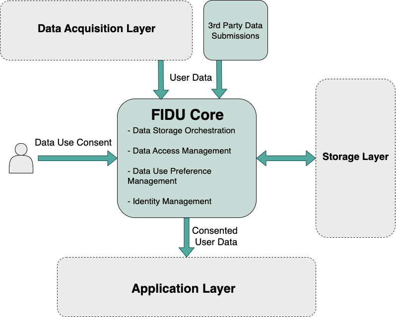

# FIDU

Take control of your digital identity and break free from Big Tech. The FIDU app empowers users to collect and securely store their personal data, define precise preferences for its usage, and serve it to applications and agents strictly on their terms.

## More about FIDU

https://firstdataunion.org

## The Project (IMPORTANT)

This project aims to demonstrate a taste of FIDU's vision. This is an extremely early version, and we're working hard to add new features and apps all the time.

We are offering this early alpha to encourage those interested in our journey to start interacting with our tools, hopefully finding some useful functionality for themselves, as well as helping to shape its future.

Due to the early stage of this project, there are many caveats to the guarantees we provide so far. Be sure to understand these before using any of our tools.

### The Goal

The application will collect user data via an extensible ecosystem of data collection tools in the “Data Collection Layer,” starting with our initial web browser plugin. These tools transmit collected data to the core FIDU App, which then orchestrates its storage using a set of configurable and extensible storage options. Furthermore, the main application provides a user interface to define and manage your data sharing and usage preferences. Finally, authorised "Application Layer" programs can access and utilise your data according to these defined preferences.



## Current Functionality

### FIDU Vault

A locally run server that must be running to use other apps. It manages the storage and retrieval of user data and currently offers local storage only.

There is a basic front end that allows users to view their raw stored data and manage profiles for their account.

**IMPORTANT:**

- **Data Compatibility:** We will do our best to maintain stored data and compatibility in future versions, but due to the very early nature of this project, we cannot guarantee this yet. The current project is offered as an experimental offering and should not be relied on for permanence.
- **Data Security:** Please note that as of writing, data encryption is not in place for the stored local data. Be aware of this, and avoid storing any sensitive data in the application. This is an experimental alpha, and we cannot yet guarantee the security of data stored.

### FIDU Chat Grabber

A Chrome plugin that allows the automatic capture of conversations with chatbots. Supports:
- ChatGPT
- Claude
- Google Gemini
- Poe
- Perplexity

Conversations are stored in FIDU Vault and will be available for use in future application layer programs.

**IMPORTANT:**  
Currently, the FIDU-Chat-Grabber plugin can only store data if the FIDU Server is running on your machine, and there is no mechanism (yet) to hold data for later use.

## Installation

### FIDU Vault

We currently provide three versions of the pre-built FIDU program: Windows, macOS, and Linux.

**NOTE:** Due to early alpha status, our testing of support on all versions of these OSes is limited. Please feel free to report any issues to us!

Coming Soon: Links to download these.

Once downloaded, you can run the executable to start the local FIDU Vault server, which should automatically open a browser page to create or log in to a FIDU account. This server should remain running while using any other FIDU apps.

### FIDU Chat Grabber

More detailed information on this plugin can be found here:  
https://github.com/FirstDataUnion/FIDU/blob/main/src/data_acquisition/fidu-chat-grabber/README.md

To install it into Chrome, perform the following:

1. Open Chrome and navigate to chrome://extensions/
2. Enable "Developer mode" (toggle in the top right)
3. Click "Load unpacked" and select the extension directory (.../FIDU/src/data_acquisition/fidu-chat-grabber)
4. The FIDU Chat Grabber icon should appear in your Chrome toolbar

Once installed, use the plugin option box in the top right of your browser to log into your FIDU account. Any conversations in the supported chatbots in Chrome will be automatically saved to FIDU Vault.

## Running in Developer Mode

You may also run the FIDU Vault server in development mode. To do this, run the following command from the project root to install all development dependencies:

```sh
source scripts/setup_dev.sh
```

It will also create and activate a Python venv, into which all requirements will be installed to keep it self-contained.

Then a dev server can be run via either:

```sh
uvicorn src.fidu_vault.main:app --port 4000 --reload
```
(this provides automatic hot-reload functionality)

or

```sh
.venv/bin/python src/fidu_vault/main.py
```
(no hot-reload)

## Contributing

We do not have a contribution process in place just yet. However, we're working on it, and would love to hear any thoughts you have in the meantime!

## License

[MIT License](LICENSE)
